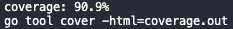

<h3>Snapfi Backend Code Challenge</h3>

---

A Snapfi se propõe a resolver um problema identificado entre os MEI e autônomos: A dificuldade de gestão financeira que essas pessoa tem. Para isso, o [desafio](https://github.com/snapfi/backend-code-challenge) foi implementar uma API em Go capaz de simular uma transação.
    <br> 

## ⛓️ Dependências

- 🐳 [Docker](https://docs.docker.com/desktop/)
- [Golang](https://golang.org/doc/install)
- [Goose](https://github.com/pressly/goose)
- [Mock](https://github.com/golang/mock)
- [Swag](https://github.com/swaggo/swag)

## 🏁 Como rodar

Esse projeto possui um makefile, após instaladas as dependências podemos rodar os seguintes comandos:<br>

* Rode o comando `make run` para iniciar o container docker e a API.
* Em outro terminal, rode o comando `make mig-up` para criar as tabelas necessárias no banco de dados.
<br>
Pronto! Sua aplicação estará disponível rodando localhost na porta `:1323`.
<br>
Caso deseje parar o container docker, há disponível o comando `make stop`.

### Como rodar os testes unitários

* `make test` executa os testes unitários e apresenta o percentual de cobertura
* `make test-cover` executa os testes unitários, salva e apresenta o percentual de cobertura em um arquivo
<br>
Percentual de cobertura atual


### Como acessar o swag

* Após rodar o projeto, a documentação do swagger está disponível no [endpoint](http://localhost:1323/v1/swagger/index.html)


## 🎈 Como usar a API

1° Criar dois usuários:<br>
* É necessário criar ao menos dois usuários para simularmos uma transação;
* Para isso, temos o endpoint `http://localhost:1323/v1/user [POST]`, que aceita no body param um json com o campo `name`. Exemplo:

```json
{
    "name": "Gabriel"
}
```
Podemos obter a lista de usuários criados com o endpoint `http://localhost:1323/v1/user [GET]`;

2° Incrementar o saldo de ao menos um dos usuários criados:<br>
* Para simular uma transação, é necessário que o usuário tenha um saldo disponível;
* Para isso, temos o endpoint `http://localhost:1323/v1/transaction/increase-balance [PUT]`, que aceita no body param um json com os campos `userId`, que é o ID do usuário que será incrementado o valor e `value`, que é o valor a ser incrementado no saldo. Exemplo:

```json
{
    "userId": "user-id",
    "value": 100.00
}
```

3° Realizar uma transação entre dois usuários:
* Para realizarmos uma transação, temos o endpoint `http://localhost:1323/v1/transaction [POST]`, que aceita no body param um json com os campos `sourceUserId`, que é o ID do usuário que está realizando a transação, ou seja, de onde será debitado o valor, o outro campo é o `destinationUserId`, que é o ID do usuário que irá receber o valor e o campo `amount`, que é a quantia transacionada. Exemplo:

```json
{
    "sourceUserId": "source-user-id",
    "destinationUserId": "destination-user-id",
    "amount": 100.00
}
```
## ⛏️ Tecnologias utilizadas <a name = "tech_stack"></a>

- [MySQL](https://www.mysql.com/) - Banco de dados
- [sqlx](https://pkg.go.dev/github.com/jmoiron/sqlx) - Pacote para implementar o banco de dados
- [Echo](https://echo.labstack.com/) - HTTP Framework
- [Goose](https://github.com/pressly/goose) - Ferramenta utilizada nas migrations do banco de dados
- [Mock](https://github.com/golang/mock) - Ferramenta utilizada na geração dos mocks utilizados nos testes
- [Swag](https://github.com/swaggo/swag) e [Echo-Swag](https://github.com/swaggo/echo-swagger) - Ferramenta utilizada para acessar documentação